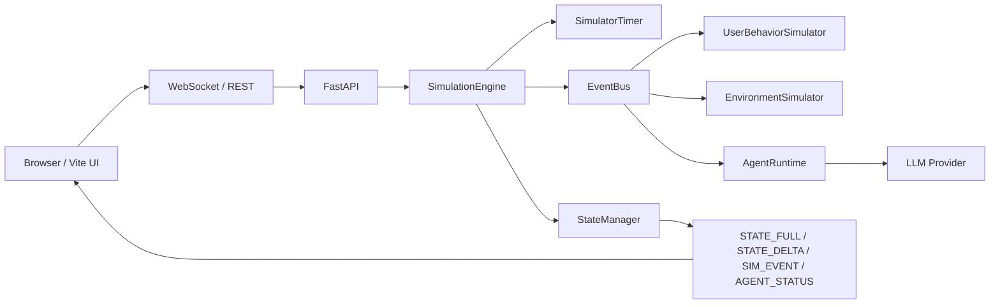

# SmartHomeSim

SmartHomeSim 是一个面向智能家居 Agent 的 3D 仿真与可观测性平台。它把三层住宅场景、事件驱动仿真、LLM Agent 和 episode 级因果链放在同一条链路里，方便你一边看场景变化，一边看 Agent 为什么这么做。

## 你可以拿它做什么

- 在 3D 公寓里查看灯光、空调、窗帘、风扇、摄像头和环境传感器的实时状态
- 直接手动控制设备，也可以让 Lighting / HVAC Agent 自动参与链路
- 通过 `user.activity_change`、`environment.state_refresh`、`reasoning.*`、`action.device_control`、`feedback.state_delta` 看完整因果链
- 用 `ObservabilityPanel` 按 episode 查看 root → reasoning → action → feedback，而不是看一堆散日志
- 在本地一键起前后端，或者用 Docker Compose 联调

## 当前完成的能力

- 事件驱动仿真内核，支持 `system.timer_tick`、`system.simulation_*`、`environment.state_refresh`、`user.activity_change`
- `observe / demo` 双模式仿真，暂停态、运行态、reset 态都能清晰区分
- Lighting / HVAC Agent 采用事件订阅式运行时，支持真实 LLM provider 和规则回退
- OpenAI Responses 和 Anthropic-compatible provider 双路接入，MiniMax 这类兼容服务可以直接联调
- `ObservabilityPanel` 已接管右滑侧栏，默认按 episode 展示推理链路
- 3D 场景已经开始消费房间级 occupancy、天气和时间变化，不再只有设备动画在动
- 本地 `.env.local` 自动加载、统一起栈脚本、Docker Compose 联调入口

## 运行效果

你启动后会看到这些状态直接出现在界面里：

- 当前是暂停还是运行
- 当前仿真模式是 `observe` 还是 `demo`
- LLM provider 是否已配置，当前用的是哪个 model
- 哪个房间有人，哪个房间灯亮了，天气和时间有没有变化
- 某次设备变化是手动点的，还是 Agent 决策出来的

## 架构一览



## 快速开始

### 1. 准备本地环境变量

在仓库根目录创建 `.env.local`：

```bash
cat > .env.local <<'ENV_EOF'
LLM_PROVIDER=anthropic_compatible
ANTHROPIC_BASE_URL=https://api.minimaxi.com/anthropic
ANTHROPIC_API_KEY=your_key_here
ANTHROPIC_MODEL=MiniMax-M2.7
LLM_TIMEOUT_MS=12000
AGENT_EPISODE_TIMEOUT_MS=15000
AGENT_ENV_DEBOUNCE_MS=5000
ENV_EOF
```

`LLM_PROVIDER` 不设置时，运行时会先尝试 `OPENAI_API_KEY`，再尝试 Anthropic-compatible 的环境变量。

### 2. 推荐方式，直接起整套开发栈

```bash
./scripts/dev-stack.sh restart
```

这会同时启动后端、前端，并做一次 WebSocket 保活检查。

### 3. 打开页面

- 前端: [http://127.0.0.1:5173](http://127.0.0.1:5173)
- 后端健康检查: [http://127.0.0.1:8000/api/health](http://127.0.0.1:8000/api/health)

### 4. 停止开发栈

```bash
./scripts/dev-stack.sh stop
```

## 也可以手动启动

### 后端

```bash
cd backend
python -m venv .venv
source .venv/bin/activate
pip install -r requirements.txt
uvicorn main:app --reload --port 8000
```

### 前端

```bash
cd frontend
npm install
npm run dev
```

### Docker Compose

```bash
docker compose up --build
```

Compose 环境下前端代理会自动指向 `http://backend:8000`。

## WebSocket 协议

### 客户端命令

- `CMD_SIM_START`
- `CMD_SIM_PAUSE`
- `CMD_SIM_RESET`
- `CMD_SIM_MODE`
- `CMD_SIM_SPEED`
- `CMD_DEVICE_CONTROL`

### 服务端消息

- `STATE_FULL`
- `STATE_DELTA`
- `AGENT_STATUS`
- `SIM_EVENT`
- `SIMULATION_STATUS`
- `ERROR`

### 结构化事件

`SIM_EVENT.event_type` 现在会覆盖这些类型：

- `system.timer_tick`
- `system.simulation_started`
- `system.simulation_paused`
- `system.simulation_reset`
- `environment.state_refresh`
- `user.command`
- `user.activity_change`
- `reasoning.perception_snapshot`
- `reasoning.intent_recognized`
- `reasoning.task_decomposition`
- `reasoning.coordination_decision`
- `reasoning.execution_plan`
- `reasoning.fallback_rule_based`
- `action.device_control`
- `feedback.state_delta`

更完整的协议细节见 `docs/architecture/ws-protocol.md` 和 `docs/architecture/sim-event-schema.md`。

## 当前支持的设备

### 设备类型

`light`、`hvac`、`curtain`、`sensor`、`fan`、`camera`

### 设备能力

`power`、`brightness`、`color_temp`、`target_temp`、`mode`、`speed`、`open_percent`、`shake`、`timeout`、`view`、`read`

## 环境变量

| 变量 | 作用 |
| --- | --- |
| `LLM_PROVIDER` | 选择 provider，常用值 `anthropic_compatible`、`openai_responses` |
| `OPENAI_BASE_URL` | OpenAI Responses API 地址 |
| `OPENAI_API_KEY` | OpenAI key |
| `OPENAI_MODEL` | OpenAI model |
| `OPENAI_REASONING_EFFORT` | OpenAI reasoning 强度 |
| `ANTHROPIC_BASE_URL` | Anthropic-compatible 地址，MiniMax 可用 |
| `ANTHROPIC_API_KEY` | Anthropic-compatible key |
| `ANTHROPIC_MODEL` | Anthropic-compatible model |
| `LLM_TIMEOUT_MS` | 单次 provider 请求超时 |
| `AGENT_EPISODE_TIMEOUT_MS` | 单个 agent episode 超时 |
| `AGENT_ENV_DEBOUNCE_MS` | 环境刷新触发 Agent 的防抖窗口 |
| `VITE_PROXY_TARGET` | 前端 Vite 代理目标，compose 下默认指向后端 |

## 项目结构

```text
SmartHomeSim/
├── backend/                 # FastAPI、仿真内核、Agent runtime、协议模型
├── frontend/                # Vue 3 + TresJS + Pinia 前端
├── docs/architecture/       # WS 协议、事件 schema、设备注册等设计文档
├── scripts/                 # 本地起栈和联调脚本
└── tests/                   # 后端与前端测试
```

## 测试

### 后端

```bash
pytest tests -q
```

### 前端

```bash
cd frontend
node --experimental-strip-types --test tests/*.test.ts
npm run build
```

### Compose 配置检查

```bash
docker compose config
```

## 设计文档

- `GSTACK_FINAL_PLAN.md`
- `docs/architecture/ws-protocol.md`
- `docs/architecture/sim-event-schema.md`
- `docs/architecture/gamemcu-device-registration-plan.md`

## 现在的方向

当前主线已经从“把场景跑起来”推进到“让仿真真的可用”。接下来主要看三件事，补更多房间级反馈，扩设备注册覆盖率，把 episode 历史和跨链路检索做得更顺手。
